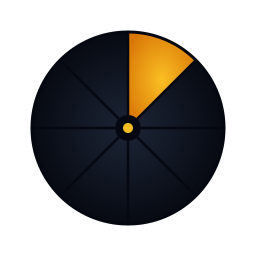
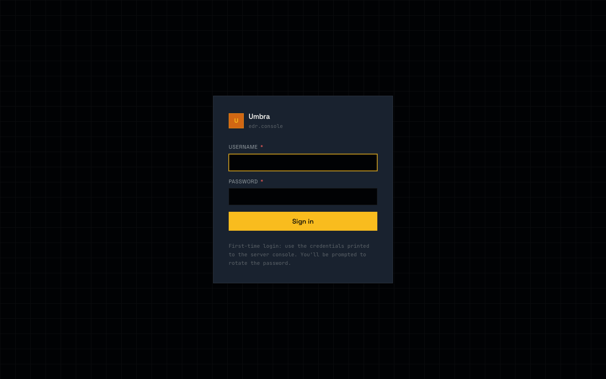
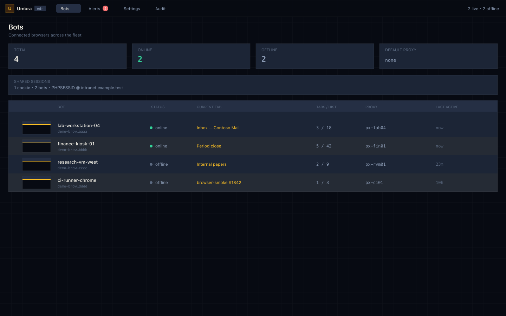
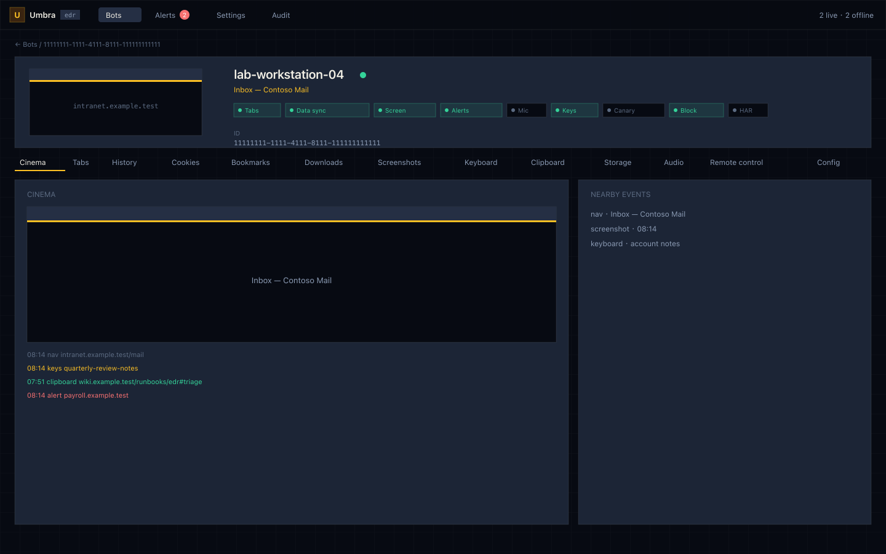
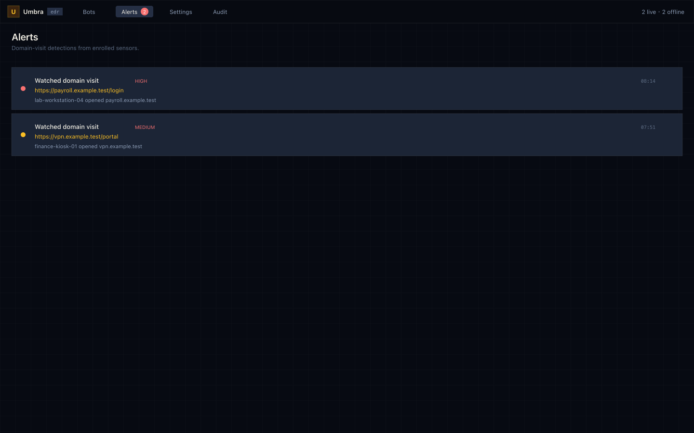
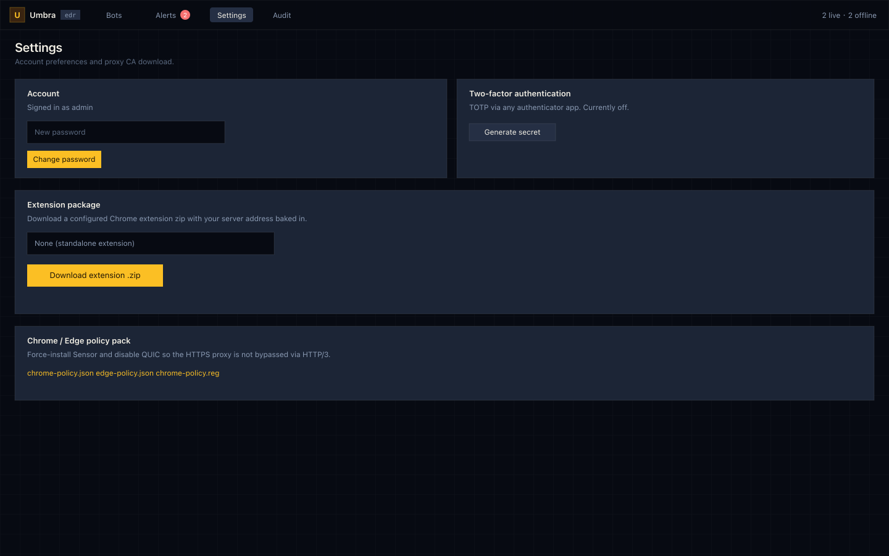

<p align="center">
  
</p>

<h1 align="center">Umbra</h1>
<p align="center"><strong>Browser-layer EDR · Light through shadow</strong></p>

<p align="center">
  <a href="#deploy-with-an-ai-agent-recommended">Deploy</a> ·
  <a href="#what-is-umbra">What it is</a> ·
  <a href="#architecture">Architecture</a> ·
  <a href="#configuration">Configuration</a> ·
  <a href="SECURITY.md">Security</a>
</p>

---

> **AUTHORIZED USE ONLY**
>
> Umbra is a dual-use security tool. It must only be deployed in environments
> where you have **explicit legal authorization** to monitor the browsers in
> question — such as corporate-owned devices under an acceptable-use policy,
> security research labs, or CI/CD systems you operate. Deploying Umbra against
> browsers you do not own or are not authorized to monitor may violate the
> Computer Fraud and Abuse Act, the GDPR, and analogous laws in your
> jurisdiction. See [SECURITY.md](SECURITY.md) for the full responsible-use
> statement.

---

## What is Umbra?

Umbra is a self-hosted browser-layer EDR. A Chrome/Edge MV3 sensor on each
enrolled endpoint talks to a central Go server over WebSocket. Operators get
a Vue 3 console: live screenshots, a time-aligned investigation cinema,
keystrokes, clipboard, cookies, history, bookmarks, downloads, page storage,
audio (with optional on-server transcription), domain alerts, identity
clusters, and an HTTP forward proxy that exits through any enrolled browser.

One binary serves the REST API, the web panel, the WebSocket relay, and the
MITM proxy. PostgreSQL and Redis sit beside it.

In-tree versions: server `0.4.0-dev` · Umbra Sensor `0.4.5` · ShadowLink `3.2.2`.

Console shots below use **synthetic lab data only** (`*.example.test`,
`lab-workstation-04`, …). They are not a live fleet. The capture
pipeline mocks `/api/v1` and rewrites the DOM before every PNG so
operator hostnames, cookies, and screen grabs cannot land in git.

<p align="center">
  
</p>
<p align="center">
  
</p>
<p align="center">
  
</p>
<p align="center">
  
</p>
<p align="center">
  
</p>

Regenerate: `python3 scripts/regen-screenshots/render-frames.py`
(layout frames) or `./scripts/regen-screenshots/run.sh --lite`
(Playwright against mocked APIs). Never point the camera at a real
operator console.

---

## Deploy with an AI agent (recommended)

Do not hand-roll Docker, env files, GUI builds, TLS, or Edge policy by
yourself. Clone this repo, open it in **Claude Code, Codex, Cursor, or Grok**,
and paste one of the prompts below. The agent should read the tree, stand the
stack up, and only then ask you to log in.

You still own two things the agent cannot: **legal authorization**, and
**rotating the generated admin password**.

### Local stand-up

```
Read CLAUDE.md, SECURITY.md, docker-compose.yaml, gui-next/vite.config.ts,
.env.example, and docs/deployment.md. CLAUDE.md is the briefing; if a path
in it disagrees with the files, trust the files.

This is authorized enterprise monitoring only. Confirm I have legal
authorization to run a local stack. If I cannot confirm that, stop.

Then stand Umbra up on this machine:

1. Copy .env.example to .env if missing. Set a strong DATABASE_PASSWORD.
   Do not invent a default password in code. Do not commit .env.
2. Build the operator panel: cd gui-next && npm ci && npm run build.
   Vite writes gui-next/dist. Root docker-compose.yaml currently mounts
   ./gui/dist as GUI_DIST_PATH. Copy or symlink the build there (or fix
   the volume) so http://localhost:8118 actually serves the Vue app.
3. docker compose up --build -d
4. Wait until GET http://localhost:8118/health returns {"success":true}.
5. Pull the generated admin password from umbra-server logs
   ("default admin user created").
6. Report: panel URL, username, password, and the three published ports.
   Host mapping today is 8118 (API+GUI), 4343 (WebSocket), 8119→8080
   (HTTP forward proxy).

Do not skip the authorized-use check. Do not commit cassl keys, .env,
or media blobs. Do not push the stack to a public host in this step.
```

Logs are JSON. First boot includes:

```json
{"level":"WARN","msg":"default admin user created","username":"admin","password":"<generated>"}
```

Open [http://localhost:8118](http://localhost:8118), sign in, rotate the
password, and enable TOTP under Settings.

### Production / fleet

Same agent, second prompt — after the local stack is healthy:

```
The local Umbra stack is up. Now do the production/fleet work.

Read docs/deployment.md and SECURITY.md again.

1. Put the panel and WebSocket behind HTTPS. Set UMBRA_PUBLIC_URL to the
   canonical https origin (no trailing slash). Edge auto-update will not
   accept HTTP.
2. Persist and back up cassl/ (MITM root CA + extkey.pem). Losing
   extkey.pem changes the Extension ID and invalidates every Edge
   forcelist already pushed.
3. Enroll endpoints. Prefer Microsoft Edge silent force-install via
   GET /ext/install-edge.bat. For Chrome, use the policy pack under
   Settings (chrome-policy.json / chrome-policy.reg) or the manual
   developer-mode path in docs/deployment.md.
4. Restrict 4343 and the proxy port at the network edge. Rotate admin
   credentials. Enable TOTP.
5. If ShadowLink Sync/Clone is in scope, follow
   docs/shadowlink-sync-clone-operations.md — server first, then Sensor,
   then wait for a trusted snapshot, then ShadowLink. Never reverse that
   order.

Tell me the public URL, Extension ID from the server log, which enroll
path you used, and what I still have to click (UAC, CBCM upload, etc.).
```

The repo is wired for this: [`CLAUDE.md`](CLAUDE.md) is the agent briefing,
[`setup.sh`](setup.sh) bootstraps a human/dev machine, and
[`docs/deployment.md`](docs/deployment.md) is the fleet runbook. Let the
agent drive those files; do not copy-paste Portainer recipes by hand.

---

## Manual fallback

Use this only if you refuse to let an agent do it.

### Docker Compose

Requires Docker, Docker Compose, and Node 20+ (to build the panel).

```bash
git clone https://github.com/s045pd/umbra-edr.git
cd umbra-edr
cp .env.example .env
# Edit .env — DATABASE_PASSWORD is required and has no default.

cd gui-next && npm ci && npm run build && cd ..
mkdir -p gui && rm -rf gui/dist && cp -R gui-next/dist gui/dist

docker compose up --build
```

`DATABASE_PASSWORD` has no default; Compose will refuse to start until it
is set. The panel is not inside the local `umbra-server` image — Compose
serves it from the `gui/dist` bind mount.

### Local development

```bash
./setup.sh          # Go 1.25+, Node 20+, .env, modules
```

Then two terminals, with PostgreSQL 14+ and Redis 6+ (or
`docker compose up db redis`):

```bash
# Terminal 1 — Go backend
cd umbra-server
make build && ./bin/umbra-server

# Terminal 2 — Vue panel (hot reload, proxies /api → :8118)
cd gui-next
npm run dev         # http://localhost:5173
```

### Sensor / ShadowLink on a test browser

Load unpacked via `chrome://extensions` (developer mode):

- `extension/` — Umbra Sensor
- `cookie-sync-extension/` — ShadowLink (cookie/credential sidecar)

Embed packaging (Sensor merged into a host extension) needs hosts from
the companion repo:

```bash
./scripts/embed-targets/fetch.sh
```

That clones [`s045pd/umbra-embed-targets`](https://github.com/s045pd/umbra-embed-targets)
into `./embed-targets/` (gitignored). Bring-your-own-host: drop any MV3
extension under `embed-targets/<name>/`.

---

## Operator console

| Route | What it is |
|-------|------------|
| `/login` | Username / password / TOTP |
| `/` | Fleet list, search, identity clusters, bulk delete, global proxy |
| `/bots/:id` | Endpoint detail |
| `/alerts` | Domain-visit detections, ack |
| `/settings` | Password, TOTP, operators, policy pack, CA, extension packaging |
| `/audit` | Mutating API calls (admin) |

Endpoint tabs: Cinema (timeline + audio playhead), Tabs, History, Cookies,
Bookmarks, Downloads, Screenshots, Keyboard, Clipboard, Storage, Audio,
Remote control, Config.

Per-endpoint switches include tab/data sync, live screenshots, domain
alerts, microphone, keystrokes, session-canary cookies, DNR blocking, and
optional debugger HAR capture.

---

## Features

### Telemetry and investigation

- **Cinema** — time-aligned nav / screenshot / keystroke / clipboard /
  download / audio timeline with a playhead
- **Live view** — SSE-driven screenshot stream from an enrolled sensor
- **Keyboard and clipboard** — searchable logs with time range
- **Browser state** — tabs, history, cookies, bookmarks, downloads,
  page `localStorage` / `sessionStorage`
- **Audio** — chunked sessions, waveform playback; production image can
  bundle whisper.cpp for overnight transcription
- **Alerts** — domain-visit playbooks from Config
- **Identity clusters** — endpoints that share a session-like cookie
- **Fleet search** — keyboard, clipboard, page text, URLs across bots

### Extension packaging

From Settings, one-click zips with the WebSocket address baked in:

- Standalone Sensor, or Sensor merged into a host extension
- Optional JS obfuscation
- Upload an MV3 zip, validate, merge Sensor, download the result
- Separate ShadowLink zip for Sync/Clone against a trusted snapshot

### Endpoint enrollment

Full guide: [`docs/deployment.md`](docs/deployment.md).

| Browser | Path | Silent? | User can remove? |
|---------|------|---------|------------------|
| **Microsoft Edge** | HKLM `ExtensionInstallForcelist` via `/ext/install-edge.bat` | yes | no |
| **Google Chrome** | CBCM / policy pack (`/ext/chrome-policy.json`, `.reg`) | yes, if enrolled | no, if policy-locked |
| **Google Chrome** | Load unpacked + `scripts/install_chrome_devmode.bat` | no | yes |

Edge is the default silent path. Chrome 127+ on personal (non-managed)
profiles has no silent install. The policy pack also sets `QuicAllowed=false`
so HTTP/3 cannot skip the MITM proxy.

Set `UMBRA_PUBLIC_URL=https://your.host` so update manifests and the BAT
embed the right origin. Back up `cassl/extkey.pem` on first boot.

### HTTP proxy

Browse as any enrolled endpoint. In Compose the proxy is published at
**host 8119** → container 8080. Authenticate with the endpoint's proxy
credentials from the console. Trust `/ca.crt` (or Settings → download CA)
before expecting HTTPS inspection to work.

### ShadowLink

ShadowLink syncs cookies/history/bookmarks/storage from an enrolled
browser onto an operator browser. Clone needs a **live** source plus a
complete trusted snapshot. Rollout order is server → Sensor → trusted
cache → ShadowLink. See
[`docs/shadowlink-sync-clone-operations.md`](docs/shadowlink-sync-clone-operations.md).

---

## Architecture

| Component | Stack | Location | Port |
|-----------|-------|----------|------|
| **Server** | Go 1.25 · chi · GORM · nhooyr/websocket | `umbra-server/` | 8118 API+GUI · 4343 WS · 8080 proxy |
| **Frontend** | Vue 3 · Vite · Tailwind CSS v4 · TypeScript | `gui-next/` | Vite writes `gui-next/dist/` |
| **Sensor** | Chrome MV3 · service worker · content scripts | `extension/` | — |
| **ShadowLink** | Chrome MV3 sidecar | `cookie-sync-extension/` | — |
| **Embed hosts** | separate public repo, fetched on demand | [`s045pd/umbra-embed-targets`](https://github.com/s045pd/umbra-embed-targets) | — |

**Compose services:** PostgreSQL 15 · Redis Alpine · `umbra-server`

Deeper docs:

- [`umbra-server/README.md`](umbra-server/README.md) — Makefile, tests
- [`gui-next/README.md`](gui-next/README.md) — panel layout (some path
  notes there still say `gui/dist`; `vite.config.ts` is the source of truth)
- [`docs/deployment.md`](docs/deployment.md) — Edge / Chrome / CBCM
- [`SECURITY.md`](SECURITY.md) — authorized use + vuln reporting

---

## Configuration

Copy `.env.example` to `.env` before first run. Compose interpolates it.

| Variable | Required | Default | Description |
|----------|----------|---------|-------------|
| `DATABASE_HOST` | yes | — | PostgreSQL hostname |
| `DATABASE_PORT` | no | `5432` | PostgreSQL port |
| `DATABASE_NAME` | no | `umbra` | Database name |
| `DATABASE_USER` | no | `umbra` | Database user |
| `DATABASE_PASSWORD` | **yes** | — | No default. Stack will not start without it. |
| `REDIS_HOST` | yes | — | Redis hostname |
| `REDIS_PORT` | no | `6379` | Redis port |
| `BCRYPT_ROUNDS` | no | `10` | Use `12+` in production |
| `API_PORT` | no | `8118` | Web panel + REST API |
| `WS_PORT` | no | `4343` | Sensor WebSocket |
| `PROXY_PORT` | no | `8080` | HTTP forward proxy (Compose publishes host `8119`) |
| `GUI_DIST_PATH` | no | `/work/gui/dist` | Vue build inside the container |
| `EXTENSION_SRC_PATH` | no | `/work/extensions` | Sensor / ShadowLink / embed hosts |
| `UMBRA_PUBLIC_URL` | prod | — | Canonical `https://host` for CRX update XML and the Edge BAT |
| `MEDIA_DIR` | no | unset | Content-addressed screenshot/audio blobs; empty keeps them in Postgres |
| `CA_DIR` | no | `./cassl` | MITM CA + CRX signing key directory |
| `SKIP_DB` | no | — | `1` = smoke mode, no DB/Redis/CA |

Transcription (`WHISPER_BIN`, `WHISPER_MODEL`, `TRANSCRIBE_NIGHTLY`) is
wired in the production image; the local Compose Dockerfile does not
bundle whisper.cpp. See [`umbra-server/DEPLOY.md`](umbra-server/DEPLOY.md)
if you need it.

---

## Project structure

```
umbra-edr/
├── umbra-server/            # Go backend (single binary)
│   ├── cmd/umbra-server/
│   └── internal/
│       ├── api/             # REST, CRX, policy pack, packaging
│       ├── ws/              # Sensor WebSocket + RPC
│       ├── proxy/           # HTTP forward proxy + MITM
│       ├── db/              # GORM models + migrations
│       ├── auth/            # sessions, bcrypt
│       ├── totp/            # operator 2FA
│       ├── detect/          # domain playbooks, DNR, canary, clusters
│       ├── browsersnapshot/ # trusted browser snapshots (ShadowLink)
│       ├── live/            # screenshot SSE hub
│       ├── blobstore/       # MEDIA_DIR blobs
│       ├── transcribe/      # optional whisper.cpp
│       ├── crxsign/         # CRX v3 signing
│       ├── busx/            # Redis pub/sub (multi-instance)
│       └── config/          # env loading
├── gui-next/                # Vue 3 operator panel
├── extension/               # Umbra Sensor (MV3)
├── cookie-sync-extension/   # ShadowLink
├── docs/                    # fleet + ShadowLink runbooks
├── scripts/
│   ├── embed-targets/fetch.sh
│   ├── regen-screenshots/   # isolated login.png pipeline
│   ├── install_edge_silent.bat
│   └── install_chrome_devmode.bat
├── setup.sh                 # dev bootstrap
├── docker-compose.yaml      # local stack
└── Dockerfile               # pre-built production image context
```

---

## CI image

[`.github/workflows/Build&Push.yml`](.github/workflows/Build&Push.yml)
builds the production context (Go binary, `gui-next` dist, extensions,
obfuscator bundle) and can push `s045pd/umbra-edr:latest`. The workflow
file currently triggers on `master`; this repository's default branch is
`main`.

There is a Portainer helper at [`deploy.sh`](deploy.sh) for operators who
already have endpoint/stack IDs. It is not the public install path — give
it to an agent along with `PORTAINER_URL`, `ENDPOINT_ID`, and `STACK_ID`
if that is how you ship.

---

## Contributing

See [CONTRIBUTING.md](CONTRIBUTING.md).

## Security

See [SECURITY.md](SECURITY.md) for the vulnerability reporting policy and
the full authorized-use statement.

## License

MIT — see [LICENSE](LICENSE). Third-party notices:
[THIRD_PARTY_NOTICES.md](THIRD_PARTY_NOTICES.md).

---

## Ethics and responsible use

Umbra is built for legitimate security and IT operations: auditing
corporate-owned endpoints, authorized red-team exercises, and incident
response on systems you administer. It is **not** a tool for surveillance
of individuals without their knowledge and consent in contexts where that
is unlawful.

The authors release this software in good faith for the security research
and enterprise IT communities. You bear full responsibility for complying
with all applicable laws and organizational policies when you deploy it.
